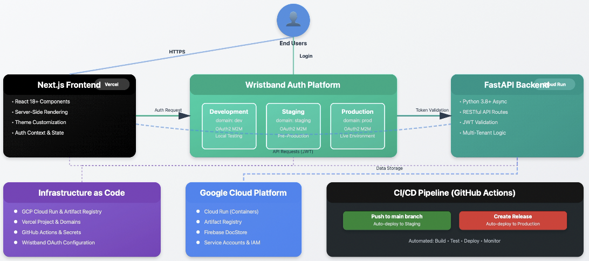
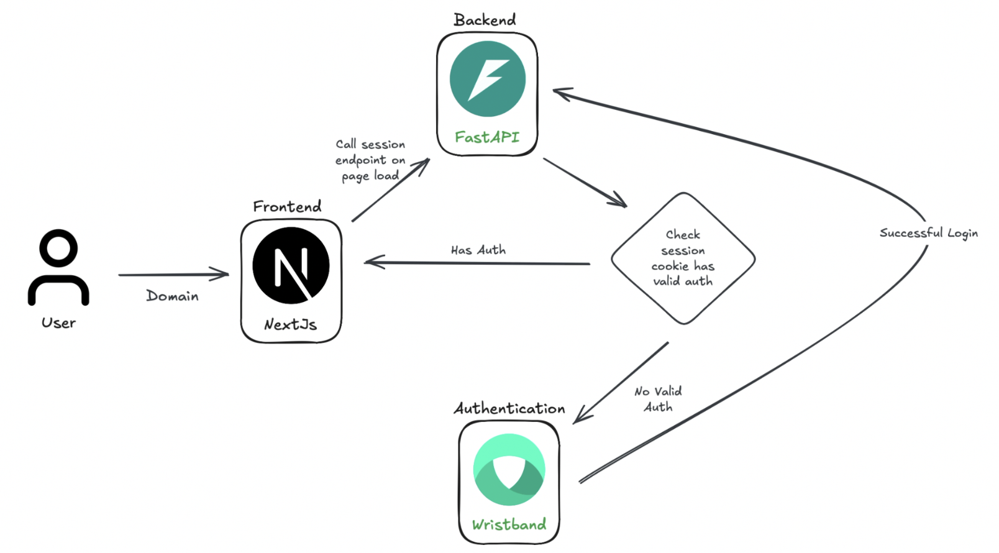

<div align="center">
  <a href="https://wristband.dev">
    <picture>
      
    </picture>
  </a>
  <p align="center">
    Enterprise-ready auth that is secure by default, truly multi-tenant, and ungated for small businesses.
  </p>
  <p align="center">
    <b>
      <a href="https://wristband.dev">Website</a> •
      <a href="https://docs.wristband.dev">Documentation</a>
    </b>
  </p>
</div>

<br/>

---

# Multi-Tenant App Accelerator


This app consists of:

- **FastAPI Backend**: A Python backend with Wristband authentication integration
- **Next.js Frontend**: A React-based frontend with authentication context
- **GCP Firebase DocStore (Optional)**: Integration to GCP Firebase for document storage
- **GCP Cloud Run (Required for Deployment)**: Integration to GCP Cloud Run to host your FastAPI backend
- **Vercel (Required for Deployment)**: Integration to Vercel to host your Next.js frontend
- **Terraform Infrastructure as Code**: Terraform scripts to provision and manage GCP, Firebase, Wristband, Github, and Vercel resources

**Infrastructure Diagram**



**Auth Flow**




## Table of Contents

- [🎯 Features](#-features)
- [📋 Requirements](#-requirements)
- [🚀 Getting Started](#-getting-started)
- [🎨 Customization](#-customization)
- [🔧 Deployment Requirements](#-deployment-requirements)
- [🌐 Deployment](#-deployment)
- [❓ Questions](#-questions)

## 🎯 Features

- **🔐 Enterprise Authentication**: Secure Wristband auth integration
- **🏢 Multi-Tenant Architecture**: Built-in tenant management
- **⚡ FastAPI Backend**: High-performance Python API
- **⚛️ Next.js Frontend**: Modern React-based UI
- **☁️ Cloud-Ready**: GCP & Vercel deployment with Terraform
- **📊 Firebase Integration**: Optional document storage
- **🛡️ Security First**: CSRF protection and secure sessions

<br>
<hr>
<br>

## 📋 Requirements

This demo app requires the following prerequisites:

### Python 3
1. Visit [Python Downloads](https://www.python.org/downloads/) or [How to install python on Mac](https://www.dataquest.io/blog/installing-python-on-mac/)
2. Download and install the latest Python 3 version
3. Verify the installation by opening a terminal or command prompt and running:
```bash
python --version # Should show Python 3.x.x
```

### Node.js and NPM
1. Visit [NPM Downloads](https://docs.npmjs.com/downloading-and-installing-node-js-and-npm)
2. Download and install the appropriate version for your OS
3. Verify the installation by opening a terminal or command prompt and running:
```bash
node --version # Should show v18.x.x or higher
npm --version  # Should show v8.x.x or higher
```
```
/bin/bash -c "$(curl -fsSL https://raw.githubusercontent.com/Homebrew/install/HEAD/install.sh)"
brew install node
```

### Terraform
1. Visit [Terraform Downloads](https://developer.hashicorp.com/terraform/install)
2. Download and install the appropriate version for your OS
3. Verify the installation by opening a terminal or command prompt and running:
```bash
terraform --version # Should show Terraform v1.x.x or higher
```
```bash
# macOS with Homebrew
brew tap hashicorp/tap
brew install hashicorp/tap/terraform
```

<br>
<hr>
<br>


## 🚀 Getting Started
You can start up the application locally in a few simple steps.

### Create a template of this GitHub Project

1. Visit the [original repository](https://github.com/wristband-dev/fastapi-accelerator)
2. Click the "Use this template" button in the top-right corner
3. Name the repository
3. On your local machine - Clone your repository:
```bash
git clone https://github.com/your-org/your-repo-name.git
cd your-repo-name
```

### Install Dependencies
```bash
npm run setup
```

### Wristband Setup

This will host your multitenant authentication, an app is needed for each environment. We will create the application and configure an oauth2 client, then use terraform to build all the infrastructure. Let's create the **DEV** application. 

#### 1) Sign up for a [Wristband account](https://wristband.dev)

#### 2) Create an App
1. Create app manually
2. Add Application
   - **Display Name**: `{App Name} (Dev)`
   - **Domain Name**: `dev`
   - **Enable Production environment validations**: `False`
3. Configure App
4. Add OAuth2 Client
   - **Client Type**: `Machine (M2M)`
   - **Client Name**: `Infrastructure`
5. Copy and Paste **Client ID** & **Client Secret** to [`infrastructure/config.tfvars`](infrastructure/config.tfvars)
6. Configure Client
   - Scroll down to the Roles section and assign `Application Admin Client` to the client
7. Copy and Paste **Application Vanity Domain** from the Application Settings to [`infrastructure/config.tfvars`](infrastructure/config.tfvars)


> 💡 **Tip**: You can also follow the other [Demo App Guide](https://docs.wristband.dev/docs/setting-up-a-demo-app) for more detailed information.


### Build the Infrastructure
> **Note:** `deployment_enabled` is set to `false` initially for locally deployment
>
> Additionally, sometimes the GCP Cloud Run API throws an error as it takes time for the resources to propogate. Wait a few minutes and rerun.
```bash
cd infrastructure
terraform init
terraform apply -var-file="config.tfvars" -auto-approve
```

What this does:
- Sets up your GCP project all the neccesary APIs and environment variables
- Sets up the Vercel project and links the domain with all the neccesary environment variables
- Creates all the github repository and environment secrets

### Run the application
Runs `backend` and `frontend` concurrently
```bash
npm start
```

<br>
<hr>
<br>


## 🎨 Customization

### Update Brand Colors & Logo
The infrastructure automatically configures both **Page Branding** (login/auth pages) and **Email Branding** (transactional emails) in Wristband using the settings in [`infrastructure/config.tfvars`](infrastructure/config.tfvars):

```hcl
# Page & Email Branding Configuration
logo_url = "https://your-domain.com/logo.svg"  # Optional - shown on auth pages and emails
color    = "#2563EB"  # Primary brand color - used for buttons, links, etc.
```

When you run `terraform apply`, this will:
- Configure Wristband's login/auth pages with your branding
- Configure all Wristband transactional emails with your branding
- Automatically update [`frontend/src/config/theme.ts`](frontend/src/config/theme.ts) with your primary color

> **Note**: Both logo and color are shared between page and email branding. The color is used for button backgrounds and borders in emails, with white text for optimal contrast.

### Manual Frontend Theme Updates
You can also manually edit [`frontend/src/config/theme.ts`](frontend/src/config/theme.ts) and change the primary color:
```typescript
export const theme = {
  colors: {
    primary: '#00AA81',  // Change to your brand color (e.g., '#2563eb' for blue)
  }
};
```

### Customize Landing Page
Edit [`frontend/src/pages/UnauthenticatedView.tsx`](frontend/src/pages/UnauthenticatedView.tsx) to update your Hero

<br>
<hr>
<br>

## 🔧 Deployment Requirements

This demo app requires the following cloud services and accounts for deployment:

### Google Cloud Platform (GCP)
1. Visit [Google Cloud Console](https://console.cloud.google.com/)
2. Create a new GCP account or sign in to your existing account
3. Set up billing for your GCP account at [Billing Setup](https://console.cloud.google.com/billing)
4. Create a new project or select an existing project
5. Note: You'll need a valid billing account to deploy Cloud Run services

### gcloud CLI
1. Visit [gcloud CLI Installation](https://cloud.google.com/sdk/docs/install)
2. Download and install the appropriate version for your OS
3. Authenticate with your GCP account:
```bash
gcloud auth login
gcloud auth application-default login
```
4. Verify the installation:
```bash
gcloud --version # Should show Google Cloud SDK version
gcloud config list # Should show your authenticated account
```
```bash
# macOS with Homebrew
brew install --cask google-cloud-sdk
```

### Vercel
1. Visit [Vercel](https://vercel.com/signup)
2. Create a new Vercel account or sign in
3. Generate a Vercel token:
   - Go to [Account Settings → Tokens](https://vercel.com/account/tokens)
   - Click "Create Token"
   - Save the token securely for Terraform configuration
4. (Optional) Purchase a custom domain:
   - Go to [Domains](https://vercel.com/domains)
   - Search and purchase your desired domain
5. Add the token to your [`infrastructure/config.tfvars`](infrastructure/config.tfvars)

### GitHub Account
1. Visit [GitHub](https://github.com/signup)
2. Create a new GitHub account or sign in
3. Generate a Personal Access Token:
   - Go to [Settings → Developer settings → Personal access tokens → Tokens (classic)](https://github.com/settings/tokens)
   - Click "Generate new token (classic)"
   - Select scopes: `repo`, `workflow`, `admin:repo_hook`
   - Save the token securely for Terraform configuration
4. Add the token and domain to your [`infrastructure/config.tfvars`](infrastructure/config.tfvars)


### Docker (Optional)
> **Note**: Docker is required for building container images when manually deploying to GCP Cloud Run. It's not needed for local development or CI/CD deployments.
1. Visit [Docker Desktop](https://www.docker.com/products/docker-desktop)
2. Download and install Docker Desktop for your OS:
   - **macOS**: Docker Desktop for Mac (Intel or Apple Silicon)
   - **Windows**: Docker Desktop for Windows
   - **Linux**: Docker Engine for Linux
3. Start Docker Desktop and ensure it's running
4. Verify the installation by opening a terminal or command prompt and running:
```bash
docker --version # Should show Docker version 20.x.x or higher
docker compose version # Should show Docker Compose version v2.x.x or higher
```
```bash
# macOS with Homebrew
brew install --cask docker
# Then launch Docker Desktop from Applications
```

<br>
<hr>
<br>


## 🌐 Deployment

### Create additional Wristband Apps
Create Staging & Prod Wristband Applications

1. Create app manually
2. Add Application
   - **Display Name**: `{App Name} (Staging) OR leave blank for Prod`
   - **Domain Name**: `staging` OR `prod`
   - **Enable Production environment validations**: `True`
3. Configure App
4. Add OAuth2 Client
   - **Client Type**: `Machine (M2M)`
   - **Client Name**: `Infrastructure`
5. Copy and Paste **Client ID** & **Client Secret** to [`infrastructure/config.tfvars`](infrastructure/config.tfvars)
6. Configure Client
   - Scroll down to the Roles section and assign `Application Admin Client` to the client
7. Copy and Paste **Application Vanity Domain** from the Application Settings to [`infrastructure/config.tfvars`](infrastructure/config.tfvars)

### Build the Infrastructure
> **Note:** `deployment_enabled` must be set to `true`
```bash
cd infrastructure
terraform init
terraform apply -var-file="config.tfvars" -auto-approve
```
to apply infrastructure to only one target use the following format
```bash
terraform apply -var-file="config.tfvars" -target='module.github[0]' -auto-approve
```

### Manual Deployment

<table>
<tr>
<td width="50%">


| Environment | Command |
|-------------|---------|
| Production  | `./deployment/deploy-prod.sh`    |
| Staging     | `./deployment/deploy-staging.sh` |


</td>
</tr>
</table>

### CI/CD Deployment

Automatic deployment triggers:
  - On push or pull request to `main` branch -> `Staging`
  - On `Release` -> `Prod`


🔗 [Workflows](.github/workflows/)

### Destroy Infrastructure 
Remove Wristband from state management as they cannot be destroyed with Terrform
```bash
cd infrastructure
terraform state rm 'module.wristband_dev' 'module.wristband_staging' 'module.wristband_prod'
```
> **Note:** Make sure you manually delete the Wristband Apps, trying to rebuild infrastructure will error as they already exist

Destroy the remaining infrastructure
```bash
terraform destroy -var-file="config.tfvars" -auto-approve
```


## ❓ Questions

Reach out to the Wristband team at <support@wristband.dev> for any questions regarding this demo app.

<br/>
