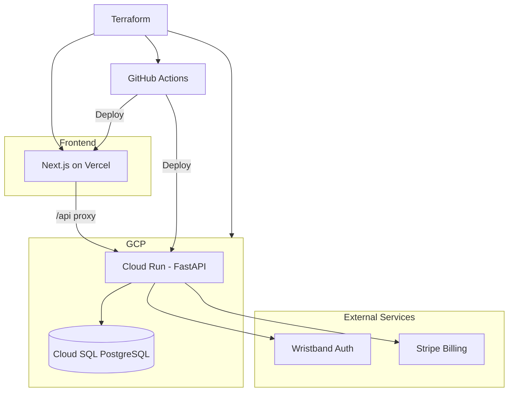
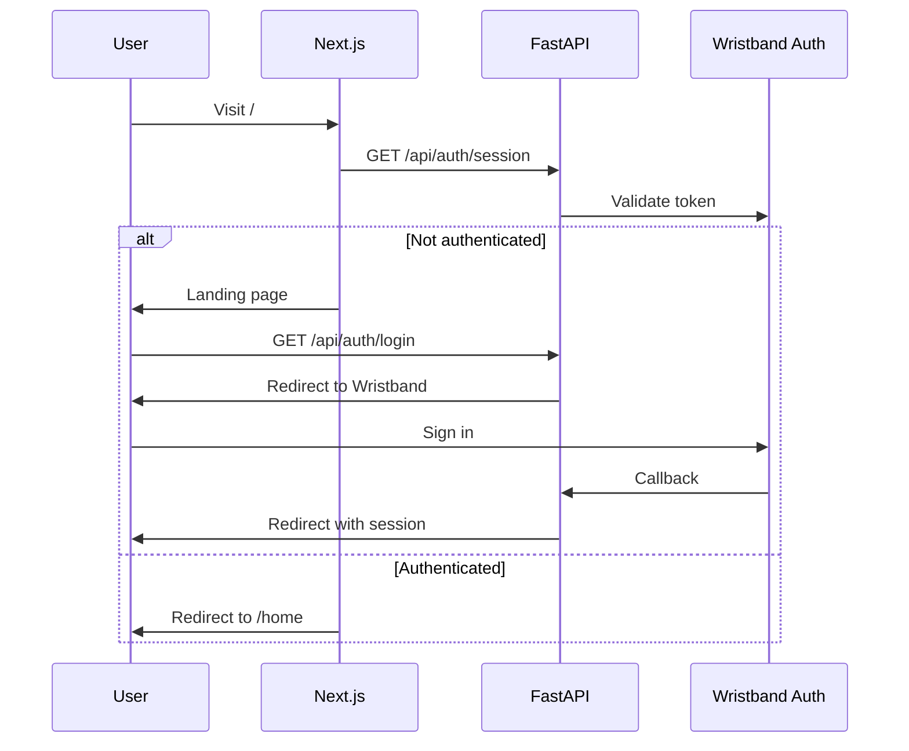
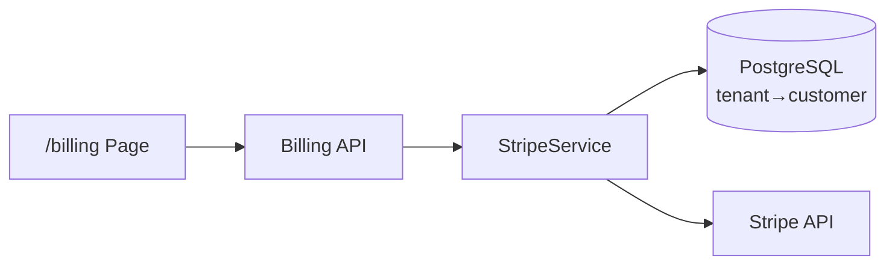

<div align="center">
  <a href="https://wristband.dev">
    <picture>
      
    </picture>
  </a>
  <p align="center">
    Enterprise-ready auth that is secure by default, truly multi-tenant, and ungated for small businesses.
  </p>
  <p align="center">
    <b>
      <a href="https://wristband.dev">Website</a> •
      <a href="https://docs.wristband.dev">Documentation</a>
    </b>
  </p>
</div>

<br/>

---

# Multi-Tenant App Accelerator


This app includes:

- **FastAPI Backend** — Python API with Wristband auth
- **Next.js Frontend** — React UI with auth context
- **PostgreSQL** — Cloud SQL (deployed) or Docker (local)
- **Stripe Billing** — Subscriptions, trials, Customer Portal
- **GCP Cloud Run** — Hosts the backend
- **Vercel** — Hosts the frontend
- **Terraform** — Provisions GCP, Wristband, GitHub, Vercel

**Architecture**


```mermaid
flowchart TB
    subgraph External [External Services]
        Wristband[Wristband Auth]
        Stripe[Stripe Billing]
    end
    subgraph GCP [GCP]
        CloudRun[Cloud Run - FastAPI]
        CloudSQL[(Cloud SQL PostgreSQL)]
    end
    subgraph Frontend [Frontend]
        Vercel[Next.js on Vercel]
    end
    Terraform[Terraform] --> GCP
    Terraform --> Vercel
    Terraform --> GitHub[GitHub Actions]
    Vercel -->|/api proxy| CloudRun
    CloudRun --> CloudSQL
    CloudRun --> Wristband
    CloudRun --> Stripe
    GitHub -->|Deploy| CloudRun
    GitHub -->|Deploy| Vercel
```

**Auth Flow**


```mermaid
sequenceDiagram
    participant User
    participant Frontend as Next.js
    participant Backend as FastAPI
    participant Wristband as Wristband Auth
    User->>Frontend: Visit /
    Frontend->>Backend: GET /api/auth/session
    Backend->>Wristband: Validate token
    alt Not authenticated
        Frontend->>User: Landing page
        User->>Backend: GET /api/auth/login
        Backend->>User: Redirect to Wristband
        User->>Wristband: Sign in
        Wristband->>Backend: Callback
        Backend->>User: Redirect with session
    else Authenticated
        Frontend->>User: Redirect to /home
    end
```

## Table of Contents

- [Features](#-features)
- [Requirements](#-requirements)
- [Getting Started](#-getting-started)
- [Stripe Setup](#-stripe-setup)
- [Customization](#-customization)
- [Make Commands](#-make-commands)
- [Deployment Requirements](#-deployment-requirements)
- [Deployment](#-deployment)
- [Questions](#-questions)

## Features

- **Enterprise Auth** — Wristband integration
- **Multi-Tenant** — Built-in tenant management
- **FastAPI + Next.js** — High-performance stack
- **PostgreSQL** — SQLModel/SQLAlchemy
- **Stripe Billing** — Subscriptions, 30-day trial, Customer Portal
- **Cloud-Ready** — Terraform for GCP & Vercel
- **Security** — CSRF protection, secure sessions

<br>
<hr>
<br>

## Requirements

| Tool | Purpose | Verify |
|------|---------|--------|
| **Python 3** | Backend | [Download](https://www.python.org/downloads/) \| `python --version` |
| **Node.js 18+** | Frontend | [Download](https://nodejs.org/) \| `node --version` |
| **Terraform** | Infrastructure | [Download](https://developer.hashicorp.com/terraform/install) \| `terraform --version` |
| **Docker** | Local PostgreSQL (required for local dev) and manual image build/push | [Download](https://www.docker.com/products/docker-desktop) \| `docker compose version` |
| **gcloud** | Manual deployment to GCP | [Install](https://cloud.google.com/sdk/docs/install) \| `gcloud --version` |

PostgreSQL is provided via Docker for local development — no separate database install is needed.

<br>
<hr>
<br>

## Getting Started

### 1. Clone the template

1. [Use this template](https://github.com/wristband-dev/fastapi-accelerator) on GitHub
2. Clone your repo: `git clone https://github.com/your-org/your-repo.git && cd your-repo`

### 2. Install dependencies

```bash
make setup
```

### 3. Wristband setup

1. Sign up at [wristband.dev](https://wristband.dev)
2. Create an app (Display Name: `{App Name} (Dev)`, Domain: `dev`)
3. Add OAuth2 Client: **Machine (M2M)**, name `Infrastructure`
4. Assign `Application Admin Client` role to the client
5. Copy **Client ID** & **Client Secret** → `infrastructure/secrets.tfvars` (copy from `secrets.tfvars.example` if needed)
6. Copy **Application Vanity Domain** → `infrastructure/config.tfvars`

> `config.tfvars` is tracked (non-sensitive). `secrets.tfvars` is gitignored — never commit it.

### 4. Build infrastructure

> Set `deploy_cloud_infrastructure = false` in `config.tfvars` for local-only. GCP APIs may take a few minutes to propagate — rerun if needed.

```bash
cd infrastructure
terraform init
terraform apply -var-file="config.tfvars" -var-file="secrets.tfvars" -auto-approve
```

This provisions GCP, Vercel, GitHub secrets, and Wristband.

### 5. Run the app

```bash
make start
```

Starts Docker PostgreSQL, backend API, and frontend.

<br>
<hr>
<br>

## Stripe Setup

Stripe powers subscription billing per tenant: Pro plan, 30-day trial, Stripe Checkout/Portal, and usage-based charges.

**Setup:** Add to `infrastructure/secrets.tfvars` before `terraform apply`:

```hcl
stripe_test_api_key = "sk_test_..."   # For dev/staging
stripe_prod_api_key = "sk_live_..."   # For production
```

**Keys:** [Stripe Dashboard → API Keys](https://dashboard.stripe.com/apikeys)

**Flow:**


```mermaid
flowchart LR
    BillingPage["/billing Page"] --> BillingAPI[Billing API]
    BillingAPI --> StripeService[StripeService]
    StripeService --> PostgreSQL[(PostgreSQL<br/>tenant→customer)]
    StripeService --> Stripe[Stripe API]
```

**Details:** See [docs/stripe-architecture.md](docs/stripe-architecture.md) for the full technical reference.

<br>
<hr>
<br>

## Customization

### Branding

Edit [`infrastructure/config.tfvars`](infrastructure/config.tfvars):

```hcl
logo_url = "https://your-domain.com/logo.svg"
color    = "#2563EB"
```

`terraform apply` configures Wristband page/email branding and updates [`frontend/src/config/theme.ts`](frontend/src/config/theme.ts).

### Landing page

Edit [`frontend/src/components/LandingView.tsx`](frontend/src/components/LandingView.tsx) to update the hero.

<br>
<hr>
<br>

## Make Commands

| Command | Description |
|---------|-------------|
| `make setup` | Install backend + frontend dependencies |
| `make start` | Start PostgreSQL, backend, and frontend |
| `make dev` | Start PostgreSQL + backend only |
| `make stop` | Stop Docker services |
| `make clean` | Remove venvs, node_modules, Docker volumes |

<br>
<hr>
<br>

## Deployment Requirements

- **GCP** — [Console](https://console.cloud.google.com/), billing enabled, project created
- **Vercel** — [Sign up](https://vercel.com/signup), [create token](https://vercel.com/account/tokens)
- **GitHub** — [PAT](https://github.com/settings/tokens) with `repo`, `workflow`, `admin:repo_hook`
- **Docker** — Required for local dev (PostgreSQL via `docker compose`) and for manual Cloud Run deploys (build/push). CI/CD runs on GitHub and uses its own Docker; you don’t need Docker on your machine for push-to-deploy.

Add tokens to `infrastructure/secrets.tfvars`.

<br>
<hr>
<br>

## Deployment

### Create Staging & Prod Wristband apps

1. Add Application (Domain: `staging` or `prod`, Production validations: `True`)
2. Add OAuth2 Client: Machine (M2M), name `Infrastructure`
3. Assign `Application Admin Client` role
4. Copy credentials to `secrets.tfvars` and vanity domain to `config.tfvars`

### Build infrastructure

> Set `deploy_cloud_infrastructure = true` in `config.tfvars`

```bash
cd infrastructure
terraform init
terraform apply -var-file="config.tfvars" -var-file="secrets.tfvars" -auto-approve
```

Target a single module: `-target='module.github[0]'`

### Manual deployment

| Environment | Command |
|-------------|---------|
| Production | `./deployment/deploy-prod.sh` |
| Staging | `./deployment/deploy-staging.sh` |

### CI/CD

- Push to `main` → Staging
- Release → Prod

[Workflows](.github/workflows/)

### Destroy infrastructure

Wristband cannot be destroyed via Terraform. Remove from state first:

```bash
cd infrastructure
terraform state rm 'module.wristband_dev' 'module.wristband_staging' 'module.wristband_prod'
```

Then manually delete Wristband apps. Finally:

```bash
terraform destroy -var-file="config.tfvars" -var-file="secrets.tfvars" -auto-approve
```

<br>
<hr>
<br>

## Questions

Reach out at <support@wristband.dev>.
