# Stripe Integration Architecture

This document provides a complete technical reference for the Stripe billing integration across all layers of the application: Infrastructure (Terraform), Backend (FastAPI), Frontend (Next.js), and Database (Firestore).


---

## Table of Contents

1. [Architecture Overview](#1-architecture-overview)
2. [Infrastructure Layer (Terraform)](#2-infrastructure-layer-terraform)
3. [Backend Layer (FastAPI)](#3-backend-layer-fastapi)
4. [Database Layer (Firestore)](#4-database-layer-firestore)
5. [Frontend Layer (Next.js)](#5-frontend-layer-nextjs)
6. [Complete Data Flows](#6-complete-data-flows)
7. [Environment Configuration](#7-environment-configuration)
8. [Key Integration Points](#8-key-integration-points)

---

## 1. Architecture Overview

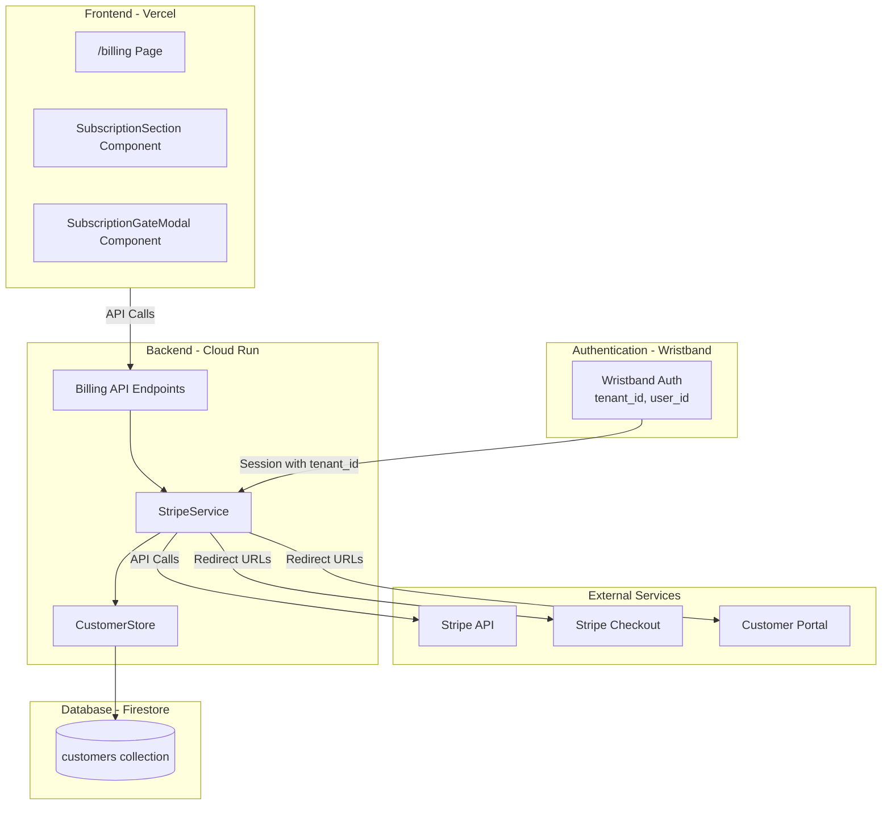

---

## 2. Infrastructure Layer (Terraform)

**File:** `infrastructure/stripe/main.tf`

### 2.1 Resources Created

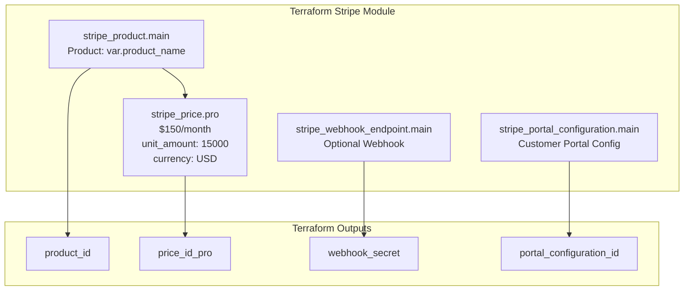

### 2.2 Resource Details

| Resource | Type | Description |
|----------|------|-------------|
| `stripe_product.main` | Product | Main subscription product (name from `var.product_name`) |
| `stripe_price.pro` | Price | Pro Plan @ $150/month (unit_amount: 15000, currency: USD, interval: month) |
| `stripe_portal_configuration.main` | Portal Config | Customer self-service portal with update/cancel features |
| `stripe_webhook_endpoint.main` | Webhook | Optional webhook endpoint (created only if `webhook_url` provided) |

### 2.3 Customer Portal Features

The portal configuration enables:
- **Customer Update**: email, address, phone
- **Invoice History**: view past invoices
- **Payment Method Update**: add/change payment methods
- **Subscription Cancel**: cancel at period end

### 2.4 Webhook Events

When configured, the webhook listens for:
- `checkout.session.completed`
- `customer.subscription.updated`
- `customer.subscription.deleted`

### 2.5 Variables

| Variable | Default | Description |
|----------|---------|-------------|
| `product_name` | "App Subscription" | Name of the Stripe product |
| `webhook_url` | "" | Backend URL for webhooks (empty = skip webhook creation) |

### 2.6 Outputs

| Output | Description |
|--------|-------------|
| `product_id` | Stripe Product ID |
| `price_id_pro` | Stripe Price ID for Pro plan |
| `webhook_secret` | Webhook signing secret (sensitive) |
| `portal_configuration_id` | Customer Portal configuration ID |

---

## 3. Backend Layer (FastAPI)

### 3.1 API Endpoints

**File:** `backend/src/api/endpoints/billing_api.py`

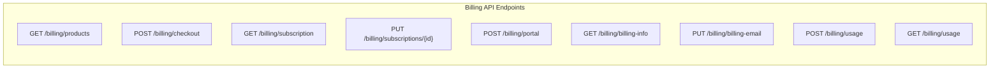

#### Endpoint Reference

| Endpoint | Method | Parameters | Description |
|----------|--------|------------|-------------|
| `/billing/products` | GET | - | List all active Stripe products with prices |
| `/billing/checkout` | POST | `price_id`, `billing_email?` | Create Stripe Checkout session, returns URL |
| `/billing/subscription` | GET | - | Get active subscription for current tenant |
| `/billing/subscriptions/{id}` | PUT | `new_price_id`, `billing_email?` | Update subscription (change plan with proration) |
| `/billing/portal` | POST | - | Create Customer Portal session, returns URL |
| `/billing/billing-info` | GET | - | Get billing email and payment method status |
| `/billing/billing-email` | PUT | `email` | Update customer billing email |
| `/billing/usage` | POST | `amount`, `description` | Add usage-based charge (in cents) |
| `/billing/usage` | GET | - | Get pending usage charges |

All endpoints require authentication via `require_session_auth` dependency.

### 3.2 Service Layer

**File:** `backend/src/services/stripe_service.py`

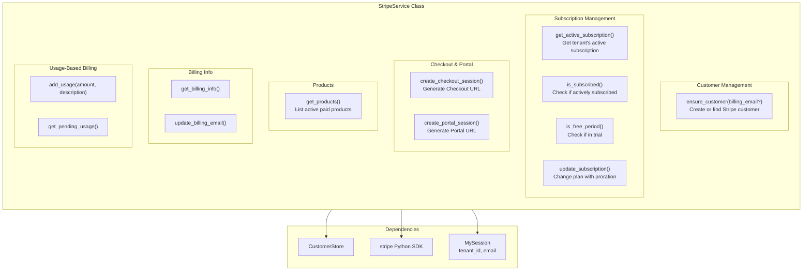

#### Key Constants

```python
FREE_TRIAL_DURATION_DAYS = 30  # Set to None to disable auto-trial
DEFAULT_CURRENCY = "usd"
```

#### Business Logic

1. **New Customer Creation** (`ensure_customer`):
   - Checks if customer exists for tenant
   - Creates Stripe customer if not found
   - Automatically creates 30-day trial subscription on Pro plan
   - Trial behavior: `missing_payment_method: cancel` (auto-cancels if no payment method added)

2. **Subscription Retrieval** (`get_active_subscription`):
   - Fetches both `active` and `trialing` subscriptions
   - Automatically cleans up duplicate subscriptions (cancels trial if paid exists)
   - Creates customer with trial if none exists

3. **Plan Updates** (`update_subscription`):
   - Handles proration automatically
   - Upgrading: charges price difference immediately
   - Downgrading: credits difference to next invoice

#### Internal Methods

| Method | Purpose |
|--------|---------|
| `_cleanup_duplicate_subscriptions()` | Cancel trial subscriptions when paid subscription exists |
| `_subscription_to_model()` | Convert Stripe subscription object to `StripeSubscription` model |

### 3.3 Data Models

**File:** `backend/src/models/stripe.py`

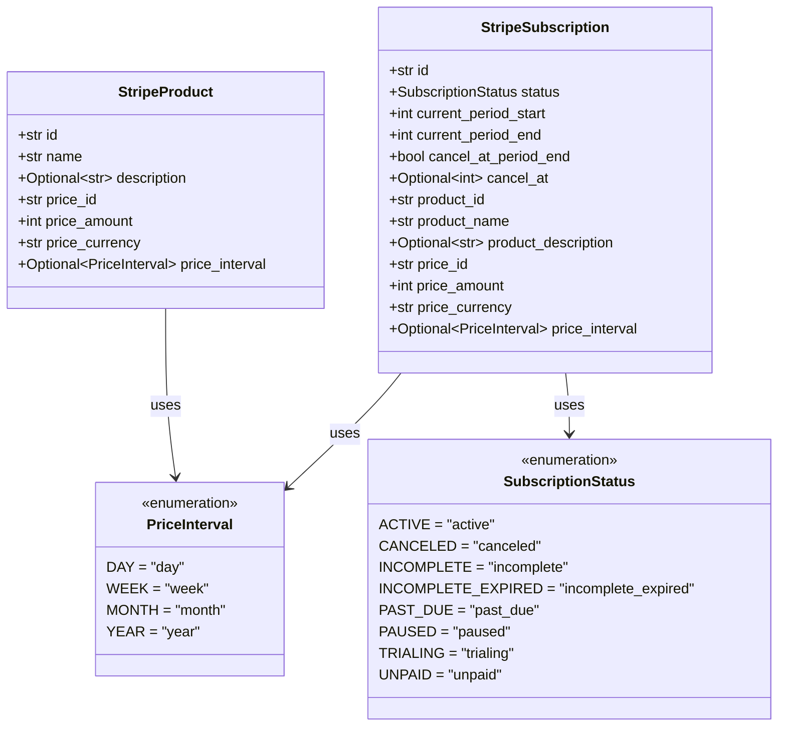

#### Type Aliases

```python
StripeProducts = List[StripeProduct]
StripeSubscriptions = List[StripeSubscription]
```

---

## 4. Database Layer (Firestore)

**Files:**
- `backend/src/models/customer.py`
- `backend/src/stores/customer_store.py`

### 4.1 Customer Model

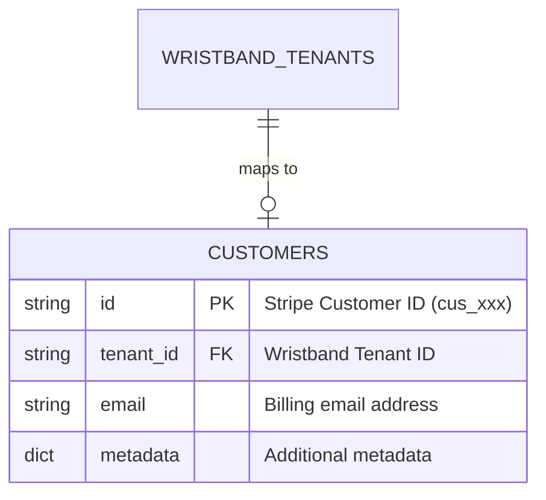

### 4.2 Storage Pattern

| Property | Value |
|----------|-------|
| Collection Name | `customers` |
| Scope | **Global** (NOT tenant-scoped) |
| Document ID | Stripe Customer ID (`cus_xxx`) |
| Purpose | Maps Wristband `tenant_id` to Stripe `customer_id` |

### 4.3 CustomerStore Configuration

```python
class CustomerStore(BaseStore[Customer]):
    COLLECTION = "customers"
    
    def __init__(self, session: MySession):
        super().__init__(
            session, 
            self.COLLECTION, 
            Customer,
            use_tenant_scope=False  # Global collection
        )
```

**Why Global?** Customer records map tenant IDs to Stripe customer IDs. They're queried by `tenant_id` field, not scoped under tenant paths.

### 4.4 Database Operations

| Operation | Description |
|-----------|-------------|
| `get_by_field("tenant_id", tenant_id)` | Find customer by Wristband tenant |
| `add(Customer(...))` | Create new customer mapping |
| `update(customer_id, Customer(...))` | Update customer (e.g., billing email) |

---

## 5. Frontend Layer (Next.js)

**Files:**
- `frontend/src/pages/billing.tsx`
- `frontend/src/components/billing/SubscriptionSection.tsx`
- `frontend/src/components/billing/SubscriptionGateModal.tsx`

### 5.1 Component Architecture

```mermaid
flowchart TB
    subgraph pages [Pages]
        billing_page["/billing<br/>Billing Page"]
    end
    
    subgraph components [Components]
        SubscriptionSection["SubscriptionSection<br/>Full billing management UI"]
        SubscriptionGateModal["SubscriptionGateModal<br/>Blocking paywall for expired trials"]
    end
    
    subgraph features [SubscriptionSection Features]
        direction TB
        current_plan[Current Plan Status<br/>Shows active/trialing/canceling]
        plan_select[Plan Selection<br/>Radio buttons for available plans]
        alternate_email[Alternate Billing Email<br/>Optional override]
        checkout_btn[Checkout / Upgrade Button]
        copy_link[Copy Payment Link<br/>For sharing]
        portal_btn[Customer Portal Button<br/>Payment method management]
        billing_email_edit[Billing Email Editor]
        usage_section[Usage Charges Section<br/>Add/view pending charges]
    end
    
    subgraph gate_features [SubscriptionGateModal Features]
        direction TB
        gate_plan_select[Plan Selection]
        gate_checkout[Subscribe Now Button]
        gate_copy_link[Copy Payment Link]
        gate_logout[Sign Out Option]
    end
    
    billing_page --> SubscriptionSection
    billing_page -->|query params| success_msg[Success Message]
    billing_page -->|query params| cancel_msg[Canceled Message]
    
    SubscriptionSection --> current_plan
    SubscriptionSection --> plan_select
    SubscriptionSection --> alternate_email
    SubscriptionSection --> checkout_btn
    SubscriptionSection --> copy_link
    SubscriptionSection --> portal_btn
    SubscriptionSection --> billing_email_edit
    SubscriptionSection --> usage_section
    
    SubscriptionGateModal --> gate_plan_select
    SubscriptionGateModal --> gate_checkout
    SubscriptionGateModal --> gate_copy_link
    SubscriptionGateModal --> gate_logout
```

### 5.2 Billing Page (`/billing`)

Handles:
- Success message display (`?success=true`)
- Canceled message display (`?canceled=true`)
- URL cleanup after showing messages

### 5.3 SubscriptionSection Component

**State Management:**

| State | Purpose |
|-------|---------|
| `activeSubscription` | Current tenant subscription |
| `products` | Available Stripe products/prices |
| `selectedPriceId` | Currently selected plan |
| `billingInfo` | Email and payment method status |
| `pendingUsage` | Pending usage-based charges |
| `useAlternateEmail` | Toggle for alternate billing email |
| `alternateEmail` | Alternate email value |

**Features:**

1. **Current Plan Display**: Shows plan name, price, renewal/cancellation date, status badge
2. **Plan Selection**: Radio buttons for available paid plans with "Current" badge
3. **Alternate Billing Email**: Checkbox to use different email for billing
4. **Actions**:
   - Upgrade/Change Plan (redirects to Stripe Checkout or updates subscription)
   - Copy Payment Link (copies checkout URL to clipboard)
   - Update Payment Method (redirects to Stripe Portal)
5. **Billing Email Management**: Edit billing email in-place
6. **Usage Charges**: Add quick charges ($5, $10, $25) and view pending charges

### 5.4 SubscriptionGateModal Component

**Purpose:** Blocking modal shown when trial has ended and no active subscription exists.

**Behavior:**
- Cannot be dismissed (no close button, no backdrop click)
- User must subscribe or sign out
- Prevents body scroll while open

### 5.5 API Integration

All API calls use `frontendApiClient` (Axios instance with CSRF protection):

```typescript
// Base configuration
const frontendApiClient = axios.create({
  baseURL: '/api',
  xsrfCookieName: 'CSRF-TOKEN',
  xsrfHeaderName: 'X-CSRF-TOKEN',
  withCredentials: true,
  withXSRFToken: true,
});
```

| API Call | Usage |
|----------|-------|
| `GET /billing/products` | Fetch available plans on mount |
| `GET /billing/subscription` | Fetch current subscription on mount |
| `POST /billing/checkout` | Create checkout session for upgrade |
| `PUT /billing/subscriptions/{id}` | Change plan (proration) |
| `POST /billing/portal` | Open customer portal |
| `GET /billing/billing-info` | Get billing email/payment status |
| `PUT /billing/billing-email` | Update billing email |
| `POST /billing/usage` | Add usage charge |
| `GET /billing/usage` | Fetch pending usage |

---

## 6. Complete Data Flows

### 6.1 New User Signup Flow

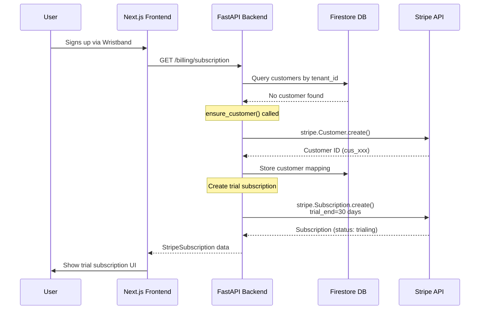

### 6.2 Checkout Flow (Upgrade from Trial)

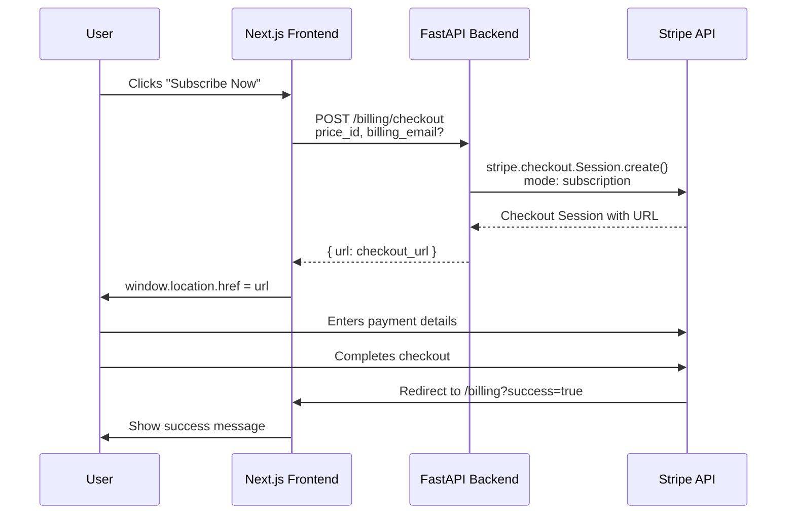

### 6.3 Plan Change Flow (Existing Subscription)

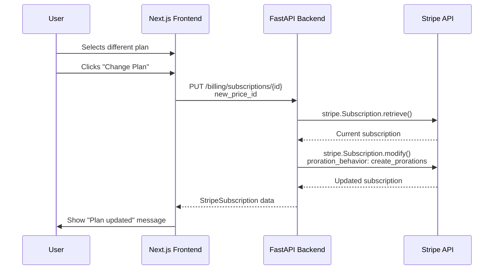

### 6.4 Customer Portal Flow

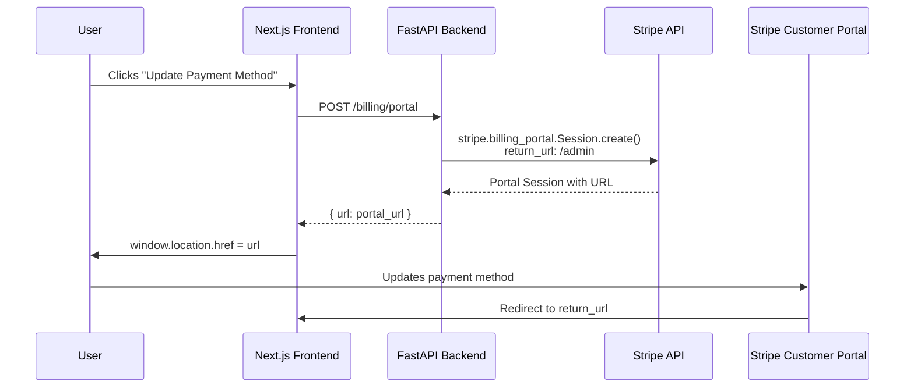

### 6.5 Usage-Based Billing Flow

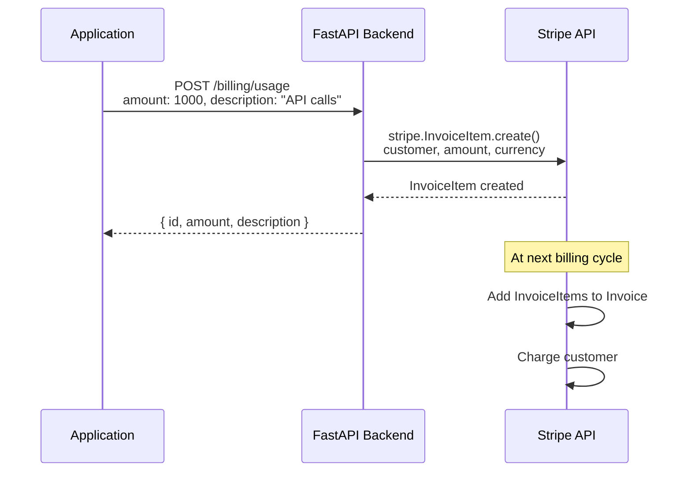

---

## 7. Environment Configuration

### 7.1 Environment Variables

**File:** `backend/src/environment.py`

| Variable | Required | Description |
|----------|----------|-------------|
| `STRIPE_SECRET_KEY` | Yes | Stripe API secret key (sk_test_* or sk_live_*) |
| `ENVIRONMENT` | No | DEV (default) / STAGING / PROD |

### 7.2 Environment-Specific Keys

| Environment | Key Type | Source |
|-------------|----------|--------|
| DEV | Test key | `.env.local` file |
| STAGING | Test key | GitHub Secrets (via Terraform) |
| PROD | Live key | GitHub Secrets (via Terraform) |

### 7.3 GitHub Secrets (Managed by Terraform)

| Secret | Description |
|--------|-------------|
| `STRIPE_SECRET_KEY` | Per-environment Stripe API key |
| `STRIPE_WEBHOOK_SECRET` | Webhook signing secret for verification |

---

## 8. Key Integration Points

### 8.1 Tenant-to-Customer Mapping

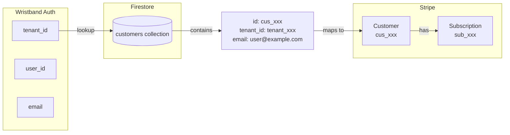

**Mapping Logic:**
1. Each Wristband tenant maps to exactly **one** Stripe customer
2. Customer record stored globally (not tenant-scoped in Firestore)
3. Lookup: `CustomerStore.get_by_field("tenant_id", session.tenant_id)`
4. Customer ID stored as document ID in Firestore

### 8.2 Authentication Flow

All billing endpoints require session authentication:

```python
router = APIRouter(dependencies=[Depends(require_session_auth)])
```

Session provides:
- `tenant_id` - For customer lookup
- `tenant_name` - For Stripe customer metadata
- `email` - Default billing email

### 8.3 Error Handling

All endpoints return consistent error responses:

```json
{
  "error": "error_code",
  "message": "Human-readable message"
}
```

| Status Code | Error Code | When |
|-------------|------------|------|
| 400 | `bad_request` | Invalid input (e.g., invalid email) |
| 500 | `internal_error` | Stripe API error or unexpected failure |

---

## Summary

The Stripe integration provides:

1. **Infrastructure**: Terraform-managed Stripe resources (product, price, portal, webhook)
2. **Backend**: FastAPI service layer with comprehensive subscription management
3. **Database**: Firestore for tenant-to-customer mapping
4. **Frontend**: React components for billing UI with Stripe Checkout/Portal integration

Key features:
- 30-day automatic trial for new tenants
- Proration for plan changes
- Usage-based billing support
- Customer self-service portal
- Alternate billing email support
- Copy payment link functionality
